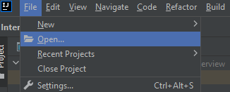
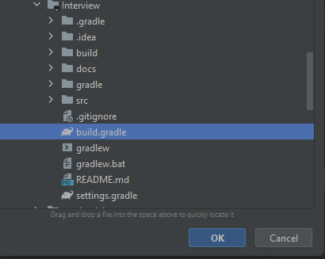
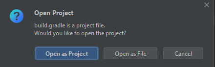
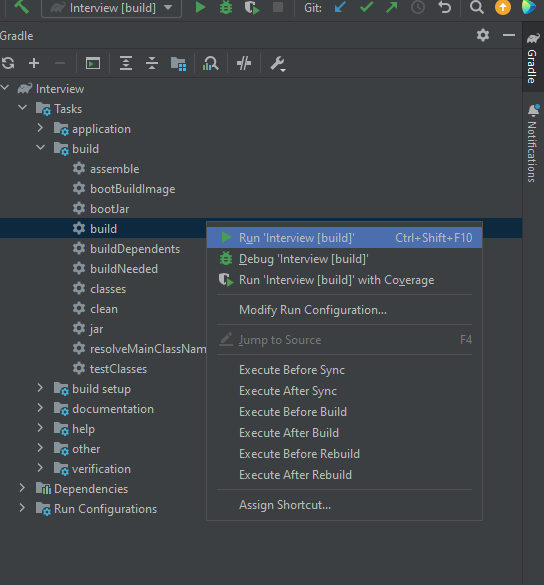
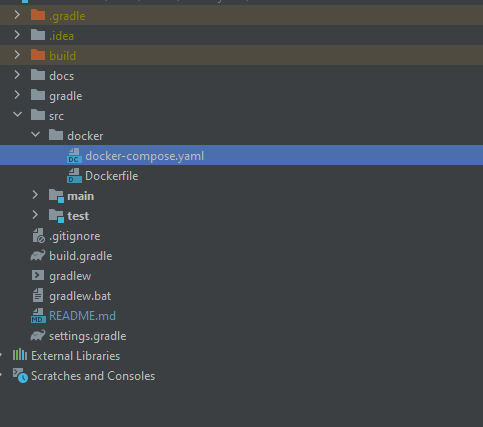
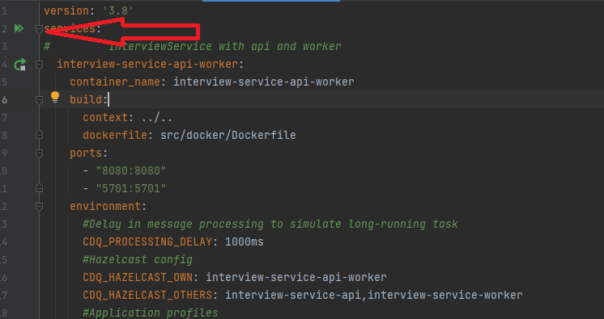
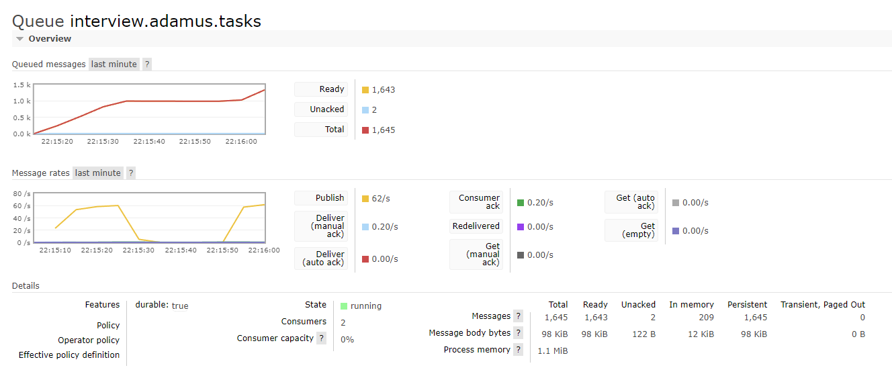

# CDQ Interview Task
Interview Task Service created by Mateusz Adamus.

## Decision made
1. Job api always returns response when task exists. When `pattern` is not matching `input` the response clearly states that no match was found.
2. If `input text` or `pattern` is missing - request is rejected
3. When designing a real api for an application that would be a real service responsible for handling long-running tasks, I would take a more generic approach. Creating a new tasks could look like this:

```json
{
  "commandsList": [
    {
      "commandType": "calculate-similarities",
      "parameters": {
        "input": "ABCABC",
        "pattern": "ADC"
      }
    },
    {
      "commandType": "another-job",
      "parameters": {
        "firstParameter": "foo",
        "second": "bar",
        "third": "foobar"
      }
    }
  ]
}
```
However, due to time constraints, some aspects of the app have been simplified as it will never be further developed. Therefore, the input object of this method looks like this:

```json
{
  "input": "inputText",
  "pattern": "exe"
}
```

### How to run this app
Below is a description of how to run the application. To run this application you need to install Java 17+ and docker. When you run docker-compose, the following components will start:
- Postgres
- RabbitMQ
- 3 instances of InterviewService(worker, api and worker with api)
- [OPTIONAL] PGAdmin - commented in docker-compose. Uncomment to run

##### TL;DR
Run `gradle build` task in root project folder, then open terminal, change working directory to `cd src/docker` and run command `docker-compose up --build`. The application is ready to use after about 2-5 minutes(pulling images not included) depending on the computer where the code is run.

#### Long description
Long description on how to launch this app using terminal or InteliJ.

##### Terminal
1. Open new terminal window
2. Change working directory where you want to copy this repo e.g. `cd ~`
3. Clone repository to your local machine `git clone https://github.com/AdamusMateusz/Interview.git`
4. Change directory to root folder of this project `cd Interview`
5. Build project with gradle. Run `.\gradlew.bat build` on Windows or `./gradlew build` on Linux/Mac
6. Change directory typing `cd src\docker` on Windows or `cd src/docker` on Linux/Mac
7. Run `docker-compose up --build`
8. To stop application press `ctrl + c`

##### IntelliJ
1. Open new terminal window
2. Change to directory where you want to copy this repo e.g. `cd ~`
3. Clone repository to your local machine `git clone https://github.com/AdamusMateusz/Interview.git`
4. Open IntelliJ
5. Click File -> open <br> 
6. Select file build.gradle on press ok <br> 
7. Open as project <br> 
8. Wait until InteliJ ends all tasks
9. Select gradle submenu from sidebar and run build task <br> 
10. Open docker-compose.yaml file <br> 
11. Run application by clicking two green arrows on top <br> 


## Caution!
Application is simulating errors. Every 20th message is retried and every 100th message is rejected.
Exceptions like the one below are normal behavior to show how the application handles exceptions.
```text
2023-05-09T13:44:55.332Z ERROR 1 --- [onPool-worker-2] c.c.i.t.e.receiver.TasksQueueListener    : Error occurred: 
2023-05-09T13:44:55.333855802Z 
2023-05-09T13:44:55.333858532Z com.cdq.interview.task.execution.mapper.RetryMessageException: Simulated exception. This is expected behaviour
2023-05-09T13:44:55.333860922Z 	at com.cdq.interview.task.execution.receiver.impl.RetryingCommandProcessor.process(RetryingCommandProcessor.java:37) ~[classes!/:1.0.0-SNAPSHOT]
2023-05-09T13:44:55.333863452Z 	Suppressed: reactor.core.publisher.FluxOnAssembly$OnAssemblyException: 
2023-05-09T13:44:55.333865592Z Assembly trace from producer [reactor.core.publisher.MonoIgnoreThen] :
2023-05-09T13:44:55.333867852Z 	reactor.core.publisher.Mono.then
2023-05-09T13:44:55.333869882Z 	com.cdq.interview.task.execution.receiver.impl.RetryingCommandProcessor.process(RetryingCommandProcessor.java:38)
2023-05-09T13:44:55.333871992Z Error has been observed at the following site(s):
2023-05-09T13:44:55.333874002Z 	*__Mono.then ⇢ at com.cdq.interview.task.execution.receiver.impl.RetryingCommandProcessor.process(RetryingCommandProcessor.java:38)
2023-05-09T13:44:55.333877002Z 	*__Mono.then ⇢ at com.cdq.interview.task.execution.receiver.impl.PercentageCountingCommandProcessor.process(PercentageCountingCommandProcessor.java:35)
2023-05-09T13:44:55.333879202Z 	*__Mono.then ⇢ at com.cdq.interview.task.execution.receiver.impl.PercentageCountingCommandProcessor.process(PercentageCountingCommandProcessor.java:35)
2023-05-09T13:44:55.333881372Z 	|_           ⇢ at com.cdq.interview.task.execution.receiver.impl.LoggingTaskCommandProcessor.process(LoggingTaskCommandProcessor.java:17)
2023-05-09T13:44:55.333883502Z Original Stack Trace:
2023-05-09T13:44:55.333885472Z 		at com.cdq.interview.task.execution.receiver.impl.RetryingCommandProcessor.process(RetryingCommandProcessor.java:37) ~[classes!/:1.0.0-SNAPSHOT]
2023-05-09T13:44:55.333898542Z 		at com.cdq.interview.task.execution.receiver.impl.PercentageCountingCommandProcessor.process(PercentageCountingCommandProcessor.java:35) ~[classes!/:1.0.0-SNAPSHOT]
2023-05-09T13:44:55.333900612Z 		at com.cdq.interview.task.execution.receiver.impl.RejectingCommandProcessor.process(RejectingCommandProcessor.java:41) ~[classes!/:1.0.0-SNAPSHOT]
2023-05-09T13:44:55.333902442Z 		at com.cdq.interview.task.execution.receiver.impl.PercentageCountingCommandProcessor.process(PercentageCountingCommandProcessor.java:35) ~[classes!/:1.0.0-SNAPSHOT]
2023-05-09T13:44:55.333905642Z 		at com.cdq.interview.task.execution.receiver.impl.LoggingTaskCommandProcessor.process(LoggingTaskCommandProcessor.java:17) ~[classes!/:1.0.0-SNAPSHOT]
2023-05-09T13:44:55.333908312Z 		at com.cdq.interview.task.execution.receiver.TasksQueueListener.executeCommand(TasksQueueListener.java:46) ~[classes!/:1.0.0-SNAPSHOT]
2023-05-09T13:44:55.333910882Z 		at com.cdq.interview.task.execution.receiver.TasksQueueListener.lambda$connect$0(TasksQueueListener.java:37) ~[classes!/:1.0.0-SNAPSHOT]
2023-05-09T13:44:55.333914522Z 		at reactor.core.publisher.FluxFlatMap$FlatMapMain.onNext(FluxFlatMap.java:386) ~[reactor-core-3.5.5.jar!/:3.5.5]
2023-05-09T13:44:55.333916512Z 		at reactor.core.publisher.FluxCreate$BufferAsyncSink.drain(FluxCreate.java:814) ~[reactor-core-3.5.5.jar!/:3.5.5]
2023-05-09T13:44:55.333918272Z 		at reactor.core.publisher.FluxCreate$BufferAsyncSink.next(FluxCreate.java:739) ~[reactor-core-3.5.5.jar!/:3.5.5]
2023-05-09T13:44:55.333920022Z 		at reactor.core.publisher.FluxCreate$SerializedFluxSink.next(FluxCreate.java:161) ~[reactor-core-3.5.5.jar!/:3.5.5]
2023-05-09T13:44:55.333921782Z 		at reactor.rabbitmq.Receiver.lambda$null$9(Receiver.java:216) ~[reactor-rabbitmq-1.5.6.jar!/:1.5.6]
2023-05-09T13:44:55.333923532Z 		at com.rabbitmq.client.impl.recovery.AutorecoveringChannel$2.handleDelivery(AutorecoveringChannel.java:588) ~[amqp-client-5.16.0.jar!/:5.16.0]
2023-05-09T13:44:55.333925342Z 		at com.rabbitmq.client.impl.ConsumerDispatcher$5.run(ConsumerDispatcher.java:149) ~[amqp-client-5.16.0.jar!/:5.16.0]
2023-05-09T13:44:55.333927112Z 		at com.rabbitmq.client.impl.ConsumerWorkService$WorkPoolRunnable.run(ConsumerWorkService.java:111) ~[amqp-client-5.16.0.jar!/:5.16.0]
2023-05-09T13:44:55.333928892Z 		at java.base/java.util.concurrent.ThreadPoolExecutor.runWorker(ThreadPoolExecutor.java:1136) ~[na:na]
2023-05-09T13:44:55.333930612Z 		at java.base/java.util.concurrent.ThreadPoolExecutor$Worker.run(ThreadPoolExecutor.java:635) ~[na:na]
2023-05-09T13:44:55.333932352Z 		at java.base/java.lang.Thread.run(Thread.java:833) ~[na:na]
```

## Api description
The API consists of two methods. Both methods are implemented in the TaskController class. Below is their detailed description.

### createTask
To call the createTask method, you need to make a `POST` request `/api/tasks/create-task-command`. According to the interview task description, the method accepts two input parameters - input and pattern. An example query looks like this:

```json
{
	"input": "ABCD",
	"pattern": "BWD"
}
```
The returned response looks like this:
```json
{
	"id": "KbUfU6mZpR-9oNxPMwKRt",
	"input": "ABCD",
	"pattern": "BWD",
	"taskStatus": {
		"statusCode": "CREATED",
		"completionInPercent": 0
	}
}
```

If one of the parameters is missing, the server will return a `400 Bad Request` response. An example response for an invalid query looks like this:
```json
{
	"timestamp": "2023-05-09T15:24:59.061+00:00",
	"path": "/api/tasks/create-task-command",
	"status": 400,
	"error": "Bad Request",
	"requestId": "3a9f132b-4"
}
```

### listTasks
To retrieve a task or list of tasks, call the `GET` method `/api/tasks`. It takes three parameters. Each of them is optional. Calling the method without any parameter will return all existing tasks. Tasks are returned in the order in which they were created.

Parameters description:

| Param name | Description                             | Type         | Example            |
|------------|-----------------------------------------|--------------|--------------------|
| taskId     | Task unique identifier                  | List<String> | ?taskId=A&taskId=B |
| limit      | How many tasks should be returned       | integer      | ?limit=100         |
| offset     | How many tasks should be skipped        | integer      | ?offset=1          |

This way you can fetch all tasks without fetching whole repository in one request.

Example response:

```json
{
	"tasksList": [
		{
			"id": "lbINFykbs_1OVjMnlcPKQ",
			"input": "ABCD",
			"pattern": "BWD",
			"taskStatus": {
				"statusCode": "ENDED",
				"completionInPercent": 100
			},
			"taskResult": {
				"isMatchFound": true,
				"position": 1,
				"typos": 1
			}
		}
	]
}
```

## How to test the API
- To begin with, I suggest running docker-compose and logging into your rabbitmq app. Rabbit is accessible at `http://localhost:15672/`. Working queue can be found here: `http://localhost:15672/#/queues/%2F/interview.adamus.tasks`. Login and password: `guest/guest`
- If the part of docker-compose responsible for starting pgadmin has been uncommented, you can visit `http://localhost:8100` and login using user: `admin@admin.com` and password: `password`. Then add connection with new server using following input:

| Parameter |        Value         |
|:---------:|:--------------------:|
| hostname  | interview-postgresql |
|   port    |         5432         |
| database  |       postgres       |
| username  |    interview_user    |
| password  |    interview_pass    |

### Example requests

Create new task:
```
curl -s --request POST --url http://localhost:8080/api/tasks/create-task-command --header 'Content-Type: application/json' --data '{"input": "ABCD","pattern": "BWD"}'
```

Try creating tasks with invalid using invalid request body:
```
curl -s --request POST --url http://localhost:8080/api/tasks/create-task-command --header 'Content-Type: application/json' --data '{"input": "ABCD"}'
```

Select all tasks:
```
curl --request GET --url 'http://localhost:8080/api/tasks?taskId=lbINFykbs_1OVjMnlcPKQ' --header 'Content-Type: application/json'
```

Select specific task:
```
curl --request GET --url 'http://localhost:8080/api/tasks?taskId=lbINFykbs_1OVjMnlcPKQ' --header 'Content-Type: application/json'
```

Select multiple tasks:
```
curl --request GET --url 'http://localhost:8080/api/tasks?taskId=lbINFykbs_1OVjMnlcPKQ&taskId=NlZPdUylliQzNLbHBWmeV' --header 'Content-Type: application/json'
```

Select first 100 tasks:
```
curl --request GET --url 'http://localhost:8080/api/tasks?limit=100&offset=0' --header 'Content-Type: application/json'
```

... and subsequent 100:
```
curl --request GET --url 'http://localhost:8080/api/tasks?limit=100&offset=100' --header 'Content-Type: application/json'
```

Also, you can create 1000 requests to stress test application:
```
time for i in {1..1000}; do curl -s --request POST --url http://localhost:8080/api/tasks/create-task-command --header 'Content-Type: application/json' --data '{"input": "ABCD","pattern": "BWD"}'; done >> /dev/null
```

Creating this amount of tasks should take about 20 seconds (about 20ms per request). As a bonus for using rabbit, we get a panel with a task processing graph. <br> .

## Scalability and performance of the solution
The application has two profiles. You can use one or both of them. The `api` profile allows you to handle REST requests. The `worker` profile starts listening for messages and processing tasks. The application can scale horizontally and vertically. Here are methods to improve its performance:
- The more processor cores, the faster the tasks and api requests will be processed
- By increasing the number of ram memory, we can cache more tasks
- By increasing the size of disk resources, we can save more data in b.d. and queue more messages (rabbit uses persistent queues resistant to server restart)
- Launching additional instances in the cluster will speed up tasks processing from queues in the case of `workers` or requests in the case of `api` because nodes are clustered using hazelcast

## Libraries and technologies used
- Java 17
- Spring boot 3.0.6 (webflux)
- Gradle 7.6.1
- jnanoid 2.0.0 (https://github.com/aventrix/jnanoid) Generating unique id for every task
- java-string-similarity 2.0.0 (https://github.com/tdebatty/java-string-similarity) Calculating difference between input and pattern
- liquibase-core 4.21.1 Creating database schema
- r2dbc-postgresql 0.8.13.RELEASE Connecting with database using non-blocking driver
- reactor-rabbitmq 1.5.6 Queuing tasks
- hazelcast 5.2.3 Distributed cache in cluster


## Possibility of transferring the solution to the production environment
The application is currently working, and you can preload it on the environment where testers will conduct tests. Logically, everything is ready, but before the real entry of such an application to real production environment, we would need to make some changes:

- The whole environment is built from the single docker-compose file. This approach was chosen for simplicity's sake, but every component should be managed separately. Ideally, database, rabbit and services should work on different machines.
- Postgres database runs on default configuration without proper security and access management. The application connects using the default root user. In the production environment technical user should have access to tables used by the application.
- Right now hazelcast connects nodes in cluster but IMap configuration is not very effective. Eviction policy, near cache and other properties should be configured.
- Rabbit works only in single node mode. In production, it is recommended to use clusters with an odd number of nodes (3, 5, 7, etc).
- Application is simulating long-running tasks using Thread.sleep and small queue prefetch count(1). In a production environment, we want maximum performance without delays. 
- Messages sent to rabbit are using single direct queue. It is recommended to use separate working queue, retry queue for retrying messages ended with exception and dead-letter queue for messages that exceeded retry limit.
- Tasks are stored infinitely. Database needs some retention mechanism.
- Under normal conditions, I would not push the application into production without any unit tests or integration tests, but due to time constraints, I regret to admit that they are missing :(

## Potential paths of development
- The task list can be streamed using Server Sent Events or via WebSocket. Right now tasks are processed in non-blocking functional stream. Collecting the result list is happening in the controller.